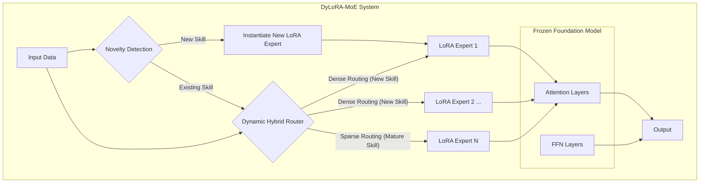
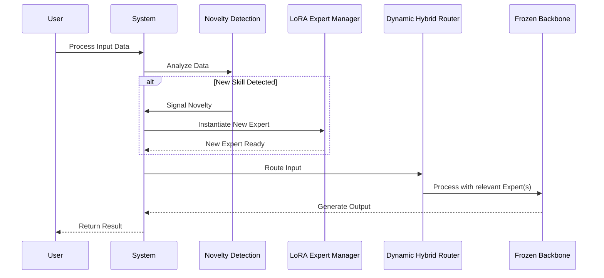

# DyLoRA-MoE: Technical Design Document

## 1. Introduction

### 1.1. Purpose
This document provides a detailed technical design for the Dynamic LoRA-based Mixture-of-Experts (DyLoRA-MoE) system. It outlines the system architecture, component design, data flows, and implementation strategy required to build and deploy the framework described in the associated technical paper.

### 1.2. Scope
The scope of this document covers the design of the DyLoRA-MoE framework, including the core components responsible for continual skill acquisition, model expansion, and dynamic routing. It will detail the mechanisms for training, data handling, and deployment. This document does not cover the specific implementation details of the underlying foundation model or the applications that will be built on top of this framework.

### 1.3. Definitions, Acronyms, and Abbreviations
- **MoE:** Mixture-of-Experts
- **LoRA:** Low-Rank Adaptation
- **PEFT:** Parameter-Efficient Fine-Tuning
- **FFN:** Feed-Forward Network
- **OOD:** Out-of-Distribution
- **LLM:** Large Language Model
- **VLM:** Vision-Language Model

### 1.4. References
- DyLoRA-MoE: A Dynamic LoRA-based Mixture-of-Experts Architecture for Continual Skill Acquisition (Technical Paper)

### 1.5. Overview
The DyLoRA-MoE system is a continual learning framework designed to incrementally acquire new skills without catastrophic forgetting. It integrates a large, frozen foundation model with a dynamic pool of lightweight LoRA experts. A novel hybrid router allocates computational resources, using a dense, collaborative strategy for new skills and a sparse, efficient strategy for mature ones. This document will elaborate on the technical design of this system.

## 2. System Architecture

### 2.1. Architectural Overview
The DyLoRA-MoE architecture is built upon a large, pre-trained transformer model that remains frozen. New skills are encapsulated in lightweight, dynamically added LoRA experts. A novelty detection module triggers the creation of new experts, and a dynamic router manages the flow of information, adapting its strategy based on skill maturity.

### 2.2. Component Breakdown
The architecture consists of four primary components working in concert.

*   **2.2.1. Frozen Foundation Model Backbone:** A large, pre-trained transformer model (e.g., LLM or VLM) that serves as a stable knowledge reservoir and feature extractor. Its parameters are not updated during skill acquisition.
*   **2.2.2. Dynamic LoRA Experts:** A pool of lightweight, parameter-efficient LoRA modules. Each expert encapsulates a specific skill and is applied to the frozen backbone. The pool can be expanded dynamically.
*   **2.2.3. Novelty-Driven Expansion Trigger:** An automated mechanism that monitors the system's performance and confidence. It triggers the creation of a new LoRA expert when it encounters out-of-distribution data that existing experts cannot handle effectively.
*   **2.2.4. Dynamic Hybrid Router:** A trainable gating network that directs input tokens to the appropriate expert(s). It dynamically shifts from a dense, collaborative routing strategy for new skills to a sparse, delegation-based strategy for mature skills.

### 2.3. Data Flow Diagram
The data flow illustrates the lifecycle of a request through the system, from initial processing to final output.

## 3. Detailed Design

### 3.1. Frozen Foundation Model Backbone
*   **3.1.1. Model Selection Criteria:** The foundation model should be a large, pre-trained transformer model with strong performance on a wide range of tasks. The choice of model will depend on the target domain (e.g., Llama 3 for language, a VLM for multimodal tasks). The model must be compatible with the Hugging Face `transformers` and `peft` libraries.
*   **3.1.2. Implementation Details:** The model will be loaded using the `transformers` library, and its parameters will be frozen by setting `requires_grad=False` for all layers.

### 3.2. Dynamic LoRA Experts
*   **3.2.1. LoRA Configuration:** Each LoRA expert will consist of a set of low-rank matrices applied to the attention and/or FFN layers of the backbone. The rank (`r`) and scaling factor (`alpha`) of the LoRA matrices will be configurable, allowing for a trade-off between parameter efficiency and expressive power.
*   **3.2.2. Expert Management Service:** A dedicated service will be responsible for creating, storing, and retrieving LoRA experts. This service will maintain a registry of all active experts and their associated skills.

### 3.3. Novelty-Driven Expansion Trigger
*   **3.3.1. Triggering Mechanisms:** The novelty detection mechanism will be implemented using one or both of the following strategies:
    *   **Router Confidence Monitoring:** The system will monitor the entropy of the router's output distribution. High entropy will indicate that no single expert is confident, suggesting a new skill.
    *   **Gradient-Based OOD Detection:** The Mahalanobis distance of gradients will be used to identify inputs that are statistically dissimilar to the training data of existing experts.
*   **3.3.2. API Definition:** The novelty trigger will expose an API to the system that allows it to check if a given input is novel.

### 3.4. Dynamic Hybrid Router
*   **3.4.1. Routing Logic:** The router will be a small neural network that takes token embeddings as input and outputs a probability distribution over the available experts. The routing logic will be implemented as follows:
    *   **Dense Collaboration:** For new skills, the router will use a "soft" routing policy, computing a weighted average of the outputs from the new expert and one or more relevant established experts.
    *   **Sparse Delegation:** For mature skills, the router will transition to a sparse top-k routing policy (e.g., top-1), delegating the task to the most specialized expert.
*   **3.4.2. Training Strategy:** The router will be trained in parallel with the LoRA experts. Its training objective will be to minimize the task loss while gradually shifting from a dense to a sparse routing policy as the experts mature.
*   **3.4.3. State Management:** The router will maintain a state for each expert, tracking its maturity level. This state will be used to determine the appropriate routing strategy.

## 4. Skill Acquisition Lifecycle

### 4.1. Phase 1: Novelty Detection
The system continuously monitors incoming data using the novelty detection module. When an out-of-distribution input is detected, the system flags it as a new skill.

### 4.2. Phase 2: LoRA Expert Instantiation
A new, randomly initialized LoRA expert is created and added to the expert pool. The expert is associated with the new skill.

### 4.3. Phase 3: Few-Shot, High-Rate Seeding
The new LoRA expert is trained on the few available examples of the new skill using a high learning rate. This allows the expert to quickly learn the basic features of the new skill.

### 4.4. Phase 4: Low-Rate Consolidation
As more data for the new skill becomes available, the expert is further trained using a low, stable learning rate. This allows the expert to fine-tune its parameters and converge to a robust solution.

### 4.5. Phase 5: Router Adaptation and Specialization
The router is trained in parallel with the expert. Initially, it learns to use the dense collaboration strategy. As the expert matures, the router's training objective shifts to favor the sparse delegation policy.

## 5. Data Management

### 5.1. Data Storage
- **Skill Data:** The few-shot examples for each new skill will be stored in a dedicated database or file system. This data will be versioned and associated with the corresponding LoRA expert.
- **Expert Registry:** The Expert Management Service will maintain a registry of all LoRA experts. This registry will be stored in a database and will contain metadata about each expert, including its skill, version, and training history.

### 5.2. Data Schemas
- **Skill Data Schema:**
  - `skill_id`: Unique identifier for the skill.
  - `expert_id`: Identifier of the LoRA expert associated with the skill.
  - `input_data`: The input data for the skill.
  - `output_data`: The expected output for the skill.
- **Expert Registry Schema:**
  - `expert_id`: Unique identifier for the expert.
  - `skill_id`: Identifier of the skill the expert is trained on.
  - `lora_config`: The configuration of the LoRA matrices (r, alpha, etc.).
  - `storage_path`: The path to the stored expert weights.
  - `maturity_state`: The current maturity level of the expert.

## 6. Deployment and Operational Considerations

### 6.1. Deployment Strategy
The DyLoRA-MoE system will be deployed as a containerized application. The foundation model and the LoRA experts will be packaged into a single container image. The system will be deployed on a cloud platform that provides GPU acceleration.

### 6.2. Monitoring and Logging
- **Monitoring:** The system will be monitored for performance and resource utilization. Key metrics to monitor include:
  - Latency of predictions.
  - GPU utilization.
  - Number of active experts.
  - Rate of new skill acquisition.
- **Logging:** The system will log all significant events, including:
  - Creation of new experts.
  - Changes in routing strategy.
  - Errors and exceptions.

### 6.3. Scalability and Performance
The DyLoRA-MoE architecture is designed to be scalable. The use of LoRA experts ensures that the model size grows slowly as new skills are added. The dynamic routing mechanism allows the system to adapt its computational cost based on the maturity of the skills.

## 7. Future Work and Extensions
- **Expert Pruning:** Develop a mechanism to prune or merge experts that are redundant or no longer in use.
- **Multi-Task Learning:** Extend the framework to support multi-task learning, where a single input can be routed to multiple experts simultaneously.
- **Automated Hyperparameter Tuning:** Develop a system for automatically tuning the hyperparameters of the LoRA experts and the router.